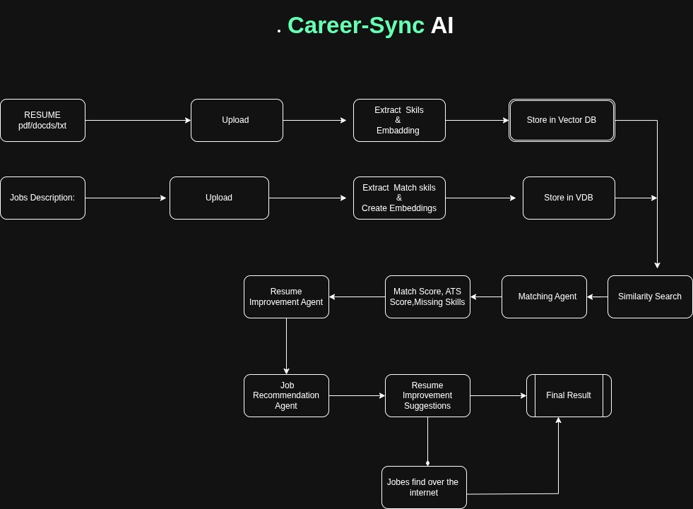

# Career-Sync-AI  
**AI-Powered ATS Resume Analyzer**

> A smart Applicant Tracking System (ATS) tool that matches resumes against job descriptions, provides detailed analytics, and gives actionable recommendations using Large Language Models.

---

## Overview

**Career-Sync-AI** is an end‑to‑end solution for automated resume screening and job matching. It ingests a resume (PDF) and a job description (TXT), extracts relevant information via embeddings and MMR retrieval, and then uses a state‑of‑the‑art LLM (Mistral) to produce a comprehensive analysis. The output includes:

- ATS match percentage  
- Matching and missing skills  
- Keyword gaps  
- Experience gaps  
- Strengths and improvement suggestions  
- A **structured final recommendation** with a verdict (shortlist or not), score, reasons, an upskill plan, and alternative role suggestions.

The system is built with **FastAPI** (backend) and **Streamlit** (frontend), and is designed to be modular, scalable, and easy to extend.

---

## 🎯 Problems Solved

| Problem | How Career-Sync-AI Addresses It |
|---------|--------------------------------|
| **Manual resume screening is time‑consuming** | Automates the entire screening process with a few clicks, saving hours of HR effort. |
| **Subjective evaluation** | Provides objective, data‑driven analysis and a clear “shortlist” recommendation with reasoning. |
| **Missing skills are hard to spot** | Explicitly lists missing skills and keywords required by the job, making gaps obvious. |
| **No actionable feedback for candidates** | Delivers a personalised upskill plan and alternative role suggestions, helping applicants improve. |
| **Recruiters struggle to compare candidates** | Returns a quantifiable match score (0‑100) and a structured verdict, enabling easy comparison. |
| **Lack of context in Q&A** | Allows natural‑language follow‑up questions based on the resume and job description, giving deeper insights. |
| **Complex infrastructure** | The modular design (FastAPI + Streamlit) makes deployment easy and supports quick updates. |

---

## Key Features

- **📄 Upload & Index**  
  Supports PDF resumes and plain‑text job descriptions. The system automatically chunks, embeds, and indexes both documents using HuggingFace `all-MiniLM-L6-v2`.

- **🔍 Intelligent Retrieval**  
  Uses **MMR (Maximum Marginal Relevance)** to retrieve the most relevant chunks from both documents, reducing redundancy and focusing on the most informative parts.

- **LLM‑Powered Analysis**  
  Leverages **Mistral Large** (via LangChain) to generate detailed, human‑like analysis and a structured JSON recommendation.

- **Interactive Dashboard**  
  Streamlit frontend provides a clean, user‑friendly interface with:
  - **Coloured verdict** (shortlist / do not shortlist)
  - **Score progress bar**
  - **Expandable waypoints** for each analysis section (ATS Match, Matching Skills, Missing Skills, etc.)
  - **Follow‑up Q&A** – ask any question about the resume or job description.

- ** Scalable & Modular**  
  The code is organised into services (embedding, retrieval, LLM) and can be extended with new models, file formats, or analysis modules.

---

## Tech Stack

| Component | Technology |
|-----------|------------|
| Backend API | **FastAPI** (Python) |
| Frontend UI | **Streamlit** (Python) |
| Embeddings | **HuggingFace `all-MiniLM-L6-v2`** (via `langchain-community`) |
| Vector Store | In‑memory (FAISS‑based) via LangChain |
| Language Model | **Mistral Large** (`mistralai/mistral-large-latest`) via `langchain-mistralai` |
| Text Processing | `RecursiveCharacterTextSplitter` |
| Retrieval | **MMR** (Maximum Marginal Relevance) |
| File Parsing | Custom `ResumeLoader` (PDF) & `docs_loader` (TXT) |
| Environment | Python 3.10+ |

---

## 🏗️ Architecture Overview

  

<h1 align="center">Career-Sync AI</h1>

  AI-powered Resume Analyzer using RAG, LangChain, ChromaDB & Mistral AI

